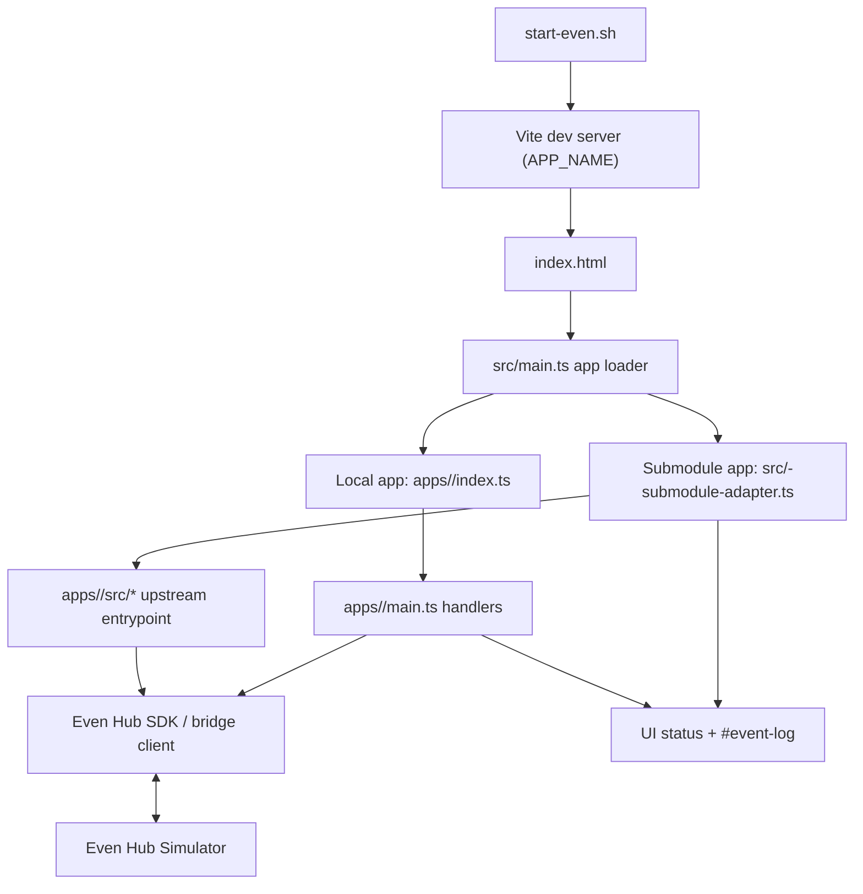

# Even Hub Painless Simulator v0.0.1


This project is a minimal starter app for building and testing Even Hub interactions in the Even Hub Simulator, without a physical Even device.

## Overview

This project is a minimal Even Hub example that works with the Even Hub Simulator and does not require a real device.

The app demonstrates:

* Basic Even Hub app structure
* TypeScript development with Vite
* Integration via `@jappyjan/even-better-sdk`
* Simulator-first workflow (no real device required)

The goal of this repository is to provide a simple starting point for building Even Hub applications while keeping the architecture easy to understand and extend.


|              AppName          |                      Short Description                          |     Visual        |
|:-----------------------------:|:----------------------------------------------------------------| :---------------: |
|    [clock](./apps/clock/)     | Clock App - app refresh test showcase                           |  |
|    [demo](./apps/demo/)       | Demo app (base) - simple control showcase                       |  |
|    [epub](https://github.com/chortya/epub-reader-g2)       | Epub reader demo @chortya/epub-reader-g2 (git submodule)        |   | 
|    [reddit](https://github.com/fuutott/rdt-even-g2-rddit-client)   | Reddit feed and comments browser @fuutott/rdt-even-g2-rddit-client (git submodule) |  |
|    [stars](https://github.com/thibautrey/even-stars)     | A real-time sky chart application @thibautrey/even-stars (git submodule) |  |
|    [timer](./apps/timer/)     | Countdown timer (1, 5 ... min, click to start, double-click to stop) |  |
|    [transit](https://github.com/langerhans/even-transit) | Public transport planner @langerhans/even-transit (git submodule) |  |
|    [restapi](./apps/restapi/) | Simple REST API client (micrOS integration)                     |  |
|    [quicktest](./apps/quicktest/) | Fast test app for UI generated by `misc/editor` @langerhans/even-ui-builder |   |

---

## ⚠️ Beta Status

This project is currently in **beta**.

Expect:

* Incomplete features
* Possible breaking changes
* Experimental structure that may evolve
* Limited error handling

Use this project as a learning example or development baseline rather than production-ready code.

---

## Requirements

* Node.js
* npm
* curl (used by `start-even.sh`)
* Even Hub Simulator
* Even Hub CLI (optional)

---

## Setup

Install dependencies:

```
npm install
```

Initialize app submodules (required for `epub`, `reddit`, `stars`, `transit`):

```
git submodule update --init --recursive
```

If cloning fresh, prefer:

```
git clone --recurse-submodules <your-repo-url>
```

Install dependencies for submodule apps that need their own `node_modules`:

```
npm --prefix apps/transit install
```

---

## Running the App

Use this flow:

```
npm install
./start-even.sh
```

When multiple apps exist under `apps/*`, the launcher prompts you to choose one by folder name.
App selection is handled in the launcher (command line), not in the web page.

You can also select directly with an environment variable:

```
APP_NAME=demo ./start-even.sh
```

Then:

1. Open the app in your browser.
2. Click **Connect**.
3. If bridge mode is available, the simulator renders the startup page.
4. Use simulator controls (Up, Down, Click, DoubleClick) to generate events.
5. Click **Demo Action** to send a sample action.

You can also run only the web app with:

```
npm run dev
```

`./start-even.sh` remains the recommended full environment because it will:

* Verify required dependencies
* Install missing packages if needed
* Start the Vite development server
* Launch the Even Hub Simulator

Note:
* `epub`, `reddit`, `stars`, and `transit` are sourced from upstream git submodules under `apps/*`.
* Submodule apps are integrated through adapter modules in `src/*-submodule-adapter.ts`.
* To update those to their latest upstream commits:

```
git submodule update --remote --merge
```

---

## Quicktest + Editor Workflow (Recommended)

Use this flow when you build UI in `misc/editor` and want to test it quickly in simulator.

1. Start the editor:

```bash
./misc/editor.sh
```

2. In the editor, generate the TypeScript output (the code that creates `const container = new CreateStartUpPageContainer(...)`).
3. Replace `/Users/bnm/Documents/Development/even/even-dev/apps/quicktest/generated-ui.ts` with that generated code.
4. Run quicktest:

```bash
APP_NAME=quicktest ./start-even.sh
```

5. Paste/edit code in the **Quicktest source** textarea if needed, then click **Render Quicktest UI**.

Notes:
* `quicktest` sends the startup UI once per app session (bridge behavior).
* No wrapper/export is required in `generated-ui.ts`; editor output is accepted as-is.
* After first render, clicking **Render Quicktest UI** rebuilds the page from current textarea content.
* Bridge button/list events are logged in the browser console (`[quicktest] bridge event`).
* After changing `generated-ui.ts`, refresh and click Connect again.
* If you want the editor setup details, see `misc/README.md`.

---

## Create a New App (under `/apps`)

Use `apps/<app_name>` (plural `apps`, not `app`) for every new app.

1. Create a folder:

```
mkdir -p apps/my-app
```

2. Add `apps/my-app/index.ts`:

```ts
import type { AppModule } from '../_shared/app-types'
import { createMyAppActions } from './main'

export const app: AppModule = {
  id: 'my-app',
  name: 'My App',
  pageTitle: 'Even Hub My App',
  connectLabel: 'Connect My App',
  actionLabel: 'Run My Action',
  initialStatus: 'My app ready',
  createActions: createMyAppActions,
}

export default app
```

3. Add `apps/my-app/main.ts`:

```ts
import type { AppActions, SetStatus } from '../_shared/app-types'

export function createMyAppActions(setStatus: SetStatus): AppActions {
  return {
    async connect() {
      setStatus('My App: connect logic...')
    },
    async action() {
      setStatus('My App: action logic...')
    },
  }
}
```

4. Run the app:

```
APP_NAME=my-app ./start-even.sh
```

Notes:
* App discovery is folder-based from `apps/*`.
* Folders starting with `_` are ignored by the launcher.
* Keep app-specific resources inside `apps/<app_name>`.

---

## Project Structure

```
index.html      -> Entry point required by Even Hub
src/main.ts     -> Common app page controller + app loader
src/*-submodule-adapter.ts -> Compatibility adapters for submodule apps
apps/_shared/app-types.ts -> Shared app contract used by all apps
apps/demo       -> Current Even demo app
apps/demo/main.ts -> Demo app actions
apps/demo/even.ts -> Demo Even SDK integration layer
apps/clock/index.ts -> Clock app module metadata
apps/clock/main.ts -> Clock app actions
apps/epub       -> Upstream epub-reader-g2 git submodule
apps/reddit     -> Upstream rdt-even-g2-rddit-client git submodule
apps/stars      -> Upstream even-stars git submodule
apps/transit    -> Upstream even-transit git submodule
vite.config.ts  -> Development server configuration
```

---

## Simulator Architecture (UML)



## Entry Points

* `start-even.sh`: CLI launcher, app selection, server boot, simulator launch.
* `src/main.ts`: Runtime app discovery and adapter dispatch.
* `src/*-submodule-adapter.ts`: Adapter layer that maps submodule app entrypoints into the shared `AppModule` contract.
* `apps/<app>/index.ts`: Local app metadata entrypoint (for non-submodule apps).
* `apps/<app>/main.ts`: Local app action handlers (for non-submodule apps).
* Submodule upstream entrypoints:
  * `apps/epub/src/main.ts`
  * `apps/reddit/src/main.ts`
  * `apps/stars/src/main.ts`
  * `apps/transit/src/main.tsx`

---

## Development Notes

* The app behaves like a standard web application.
* Communication with Even Hub happens through the Even App Bridge.
* In normal browser mode (without bridge), the app falls back to a mock mode so the UI still runs.
* In simulator mode, pressing **Connect** renders a basic demo page in the Hub simulator.
* Demo app input events are rendered in the simulator page and logged to the browser console for debugging.

---

## Disclaimer

This is a minimal example project intended for experimentation and learning. APIs and structure may change as the Even ecosystem evolves.

## Even developer packages

* CLI Tool: [evenhub-cli](https://www.npmjs.com/package/@evenrealities/evenhub-cli)
* SDK Core: [even_hub_sdk](https://www.npmjs.com/package/@evenrealities/even_hub_sdk)
* evenbetter SDK - a more abstracted SDK made by community member @JappyJan
[even-better-sdk](https://www.npmjs.com/package/@jappyjan/even-better-sdk)
* Simulator: [evenhub-simulator](https://www.npmjs.com/package/@evenrealities/evenhub-simulator)
* UIUX guideline: [link](https://www.figma.com/design/X82y5uJvqMH95jgOfmV34j/Even-Realities---Software-Design-Guidelines--Public-?node-id=2922-80782&t=ZIxZJDitnBnZJOwb-1)


## GitHub Hints

git push -u origin main
