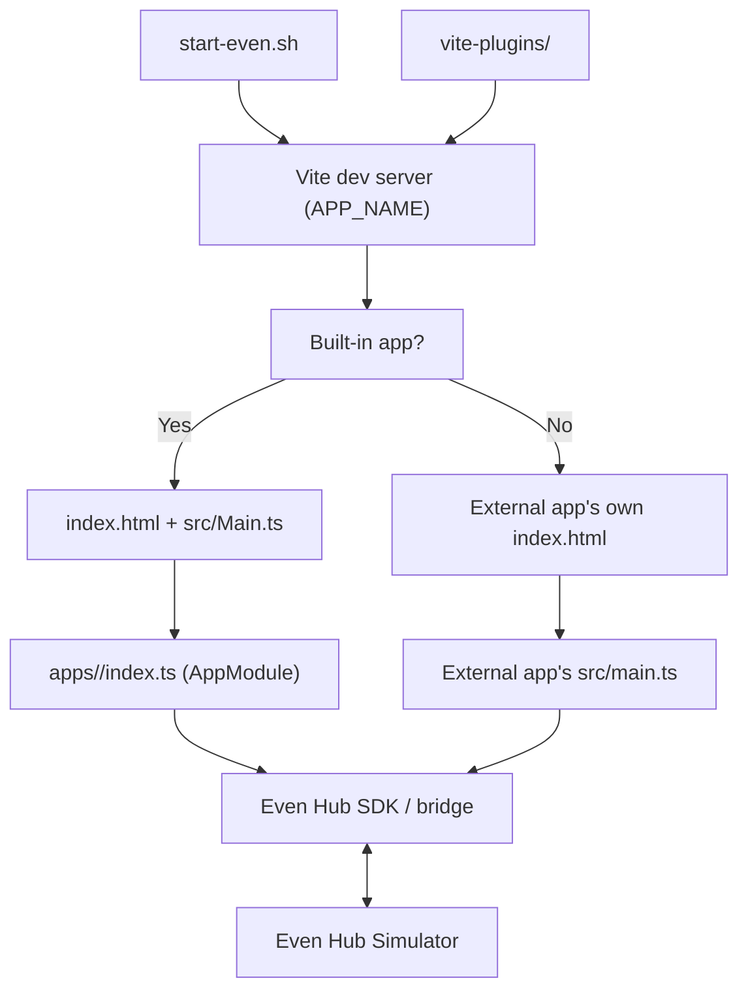

# Unified Even Hub Simulator v0.0.5

Multi-application development environment for building and testing Even G2 apps with the Even Hub Simulator.

```bash
➜  even-dev git:(main) ./start-even.sh 
Starting Even Hub development environment... http://127.0.0.1:5173

                                                    ░░███
  ██████  █████ █████  ██████  ████████           ███████   ██████  █████ █████
 ███░░███░░███ ░░███  ███░░███░░███░░███  ██████ ███░░███  ███░░███░░███ ░░███
░███████  ░███  ░███ ░███████  ░███ ░███ ░░░░░░ ░███ ░███ ░███████  ░███  ░███
░███░░░   ░░███ ███  ░███░░░   ░███ ░███        ░███ ░███ ░███░░░   ░░███ ███
░░██████   ░░█████   ░░██████  ████ █████       ░░████████░░██████   ░░█████
 ░░░░░░     ░░░░░     ░░░░░░  ░░░░ ░░░░░         ░░░░░░░░  ░░░░░░     ░░░░░
                                                                                   
Command hints:
  ./start-even.sh                  # interactive app selection
  ./start-even.sh <app-name>       # run one app directly
  ./start-even.sh --update         # refresh all git apps from apps.json
  ./start-even.sh --update <name>  # refresh one git app from apps.json
Starting Vite dev server...
Available apps:
  ID   NAME                 SOURCE
  ---- -------------------- ----------------------------------------
  1    base_app             apps/base_app
  2    timer                apps/timer
  3    restapi              apps/restapi
  4    clock                apps/clock
  5    quicktest            apps/quicktest
  6    chess                .apps-cache: github.com/dmyster145/EvenChess
  7    epub                 .apps-cache: github.com/chortya/epub-reader-g2
  8    reddit               .apps-cache: github.com/fuutott/rdt-even-g2-rddit-client
  9    stars                .apps-cache: github.com/thibautrey/even-stars
  10   transit              .apps-cache: github.com/langerhans/even-transit
  11   weather              .apps-cache: github.com/nickustinov/weather-even-g2.git
  12   snake                .apps-cache: github.com/nickustinov/snake-even-g2
  13   pong                 .apps-cache: github.com/nickustinov/pong-even-g2
  14   stt                  .apps-cache: github.com/nickustinov/stt-even-g2
  15   tetris               .apps-cache: github.com/nickustinov/tetris-even-g2
Select app [1-15] (default 1): 1
```


For general G2 development documentation, see the [G2 development notes](https://github.com/nickustinov/even-g2-notes/blob/main/G2.md).

## Apps

|              App               |                      Description                               |     Visual        |
|:------------------------------:|:----------------------------------------------------------------| :---------------: |
|    [base\_app](./apps/base_app/)        | base\_app – simple one pager app template                 |  |
|    [clock](./apps/clock/)      | Clock app – app refresh test showcase                           |  |
|    [timer](./apps/timer/)      | Countdown timer (1, 5 ... min, click to start, double-click to stop) |  |
|    [restapi](./apps/restapi/)  | Simple REST API client (micrOS integration)                     |  |
|    [quicktest](./apps/quicktest/) | Fast test app for UI generated by `misc/editor` |   |
|    [chess](https://github.com/dmyster145/EvenChess) | Chess HUD app by @dmyster145 |  |
|    [epub](https://github.com/chortya/epub-reader-g2) | Epub reader by @chortya |   |
|    [reddit](https://github.com/fuutott/rdt-even-g2-rddit-client) | Reddit feed and comments browser by @fuutott |  |
|    [stars](https://github.com/thibautrey/even-stars) | Real-time sky chart by @thibautrey |  |
|    [transit](https://github.com/langerhans/even-transit) | Public transport planner by @langerhans |  |
|    [weather](https://github.com/nickustinov/weather-even-g2) | Weather forecast by @nickustinov |  |
|    [stt](https://github.com/nickustinov/stt-even-g2) | Real-time speech-to-text via [Soniox](https://soniox.com) by @nickustinov | |
|    [smart-cart](https://github.com/bryan-datastorm/smart-cart-even-g2) | Glanceable, hands-free grocery list by @bryan-datastorm | |

---

## Requirements

* Node.js
* npm
* curl (used by `start-even.sh`)
* Even Hub Simulator

---

## Quick start

```bash
npm install
./start-even.sh
```

The launcher lists all available apps (built-in + external) and prompts you to pick one.

`misc/editor` is an auxiliary helper project tracked as a git submodule under `misc/`. It is not a runtime app in the `apps/*` selection list.

### Refresh external app cache

Use `--update` to refresh git-based apps from `apps.json`:

```bash
./start-even.sh --update
```

Update one registry app only:

```bash
./start-even.sh --update weather
```

If a cached app has local changes (for example `package-lock.json` edits), the updater auto-stashes those changes before pull and prints the stash name.

### Select an app directly

```bash
APP_NAME=demo ./start-even.sh
```

Or as a positional argument:

```bash
./start-even.sh demo
```

### Run a local app by path

If you have an app checked out locally, point to it directly – no need to edit `apps.json`:

```bash
APP_PATH=../my-app ./start-even.sh
```

This resolves the directory, installs its dependencies if needed, and launches it. The app name is derived from the directory basename.

### Audio input

Some apps (like [stt](https://github.com/nickustinov/stt-even-g2)) need microphone audio from the simulator. Pass `AUDIO_DEVICE` with the exact device ID:

```bash
AUDIO_DEVICE="coreaudio:AppleUSBAudioEngine:Apple Inc.:Studio Display:00008030-00065D000C10802E:6,7" ./start-even.sh stt
```

To find available device IDs, run:

```bash
npx @evenrealities/evenhub-simulator --list-audio-input-devices
```

This prints a table of IDs and names. Copy the full ID string from the left column. Note that `default` is not a valid device ID – you must use the exact ID.

The `AUDIO_DEVICE` value is passed to the simulator's `--aid` flag. When set, the simulator captures audio from that device, resamples it to 16 kHz S16LE PCM mono, and delivers it to your app via `bridge.audioControl(true)` / `event.audioEvent.audioPcm`.

---

## How apps are loaded

There are two kinds of apps:

### Built-in apps (`apps/`)

Small apps that live directly in the `apps/` directory (demo, clock, timer, quicktest, restapi). They share the even-dev `index.html` and `src/Main.ts` loader, and export an `AppModule` interface from `apps/<name>/index.ts`.

### External apps

Standalone web apps with their own `index.html`, `package.json`, and `vite.config.ts`. They run independently – even-dev just serves their `index.html` through Vite with the correct filesystem access.

External apps are registered in `apps.json`:

```json
{
  "chess": "https://github.com/dmyster145/EvenChess",
  "weather": "https://github.com/nickustinov/weather-even-g2.git",
  "my-local-app": "../my-local-app"
}
```

Values can be:
- **Git URLs** – cloned into `.apps-cache/` on first run
- **Local paths** – resolved relative to the even-dev root

Use `./start-even.sh --update` (or `./start-even.sh --update <app>`) to refresh cloned git entries in `.apps-cache/`.

For one-off testing without editing `apps.json`, use `APP_PATH` instead (see above).

---

## Building a G2 app

A G2 app is a regular web app. There is no special framework or wrapper required – just HTML, TypeScript, and the Even Hub SDK for communicating with the glasses.

See [chess](https://github.com/dmyster145/EvenChess) and [reddit](https://github.com/fuutott/rdt-even-g2-rddit-client) for well-structured examples.

### Minimal file structure

```
my-app/
  index.html          <- entry point
  package.json        <- dependencies and scripts
  vite.config.ts      <- dev server config
  src/
    main.ts           <- app bootstrap
  app.json            <- app metadata (for packaging)
```

### `index.html`

A standard HTML page that loads your app:

```html
<!DOCTYPE html>
<html>
<head>
  <meta charset="UTF-8" />
  <meta name="viewport" content="width=device-width,initial-scale=1" />
  <title>My App</title>
</head>
<body>
  <div id="app"></div>
  <script type="module" src="/src/main.ts"></script>
</body>
</html>
```

### `package.json`

At minimum, you need the Even Hub SDK and Vite:

```json
{
  "name": "my-even-app",
  "scripts": {
    "dev": "vite --host 0.0.0.0 --port 5173",
    "build": "vite build"
  },
  "dependencies": {
    "@evenrealities/even_hub_sdk": "^0.0.7"
  },
  "devDependencies": {
    "typescript": "^5.9.3",
    "vite": "^7.3.1"
  }
}
```

### `app.json`

Metadata file used by `evenhub-cli` for packaging and deployment:

```json
{
  "package_id": "com.example.myapp",
  "name": "my-app",
  "version": "0.1.0",
  "description": "What my app does",
  "author": "Your Name",
  "entrypoint": "index.html"
}
```

See the [reddit app's app.json](https://github.com/fuutott/rdt-even-g2-rddit-client) for a full example with permissions.

### Connecting to the Even bridge

```ts
import { waitForEvenAppBridge } from '@evenrealities/even_hub_sdk'

const bridge = await waitForEvenAppBridge()

bridge.onEvenHubEvent((event) => {
  // Handle tap, double-tap, swipe, etc.
})

// Send UI to the glasses
bridge.sendStartUpPage(container)
```

### Tips

- **Use inline styles or plain CSS** – avoid CSS frameworks like Tailwind that require build plugins, since your app may be served through even-dev's Vite config which won't have those plugins.
- **Keep it standalone** – your app should work with just `npm run dev`. Don't depend on even-dev's infrastructure.
- **If your app needs a backend server**, put it in a `server/` directory with its own `package.json`. Even-dev will auto-detect and start it (see `vite-plugins/app-server.ts`).
- **Use `@jappyjan/even-realities-ui`** for settings pages if you want consistent UI components across apps.
- **Use `@evenrealities/evenhub-cli`** for packaging and deploying to the Even Hub. See [reddit](https://github.com/fuutott/rdt-even-g2-rddit-client) for `pack` and `qr` script examples.

---

## Custom Vite plugins (`vite-plugins/`)

Even-dev has a `vite-plugins/` directory for app-specific Vite configuration that runs when serving external apps. Current plugins:

| Plugin | Purpose |
|--------|---------|
| `app-server.ts` | Auto-starts an app's `server/` process (e.g., Tesla's Tessie API proxy) |
| `browser-launcher.ts` | Opens the browser when the dev server is ready |
| `chess-stockfish.ts` | Serves Stockfish WASM assets for the chess app |
| `reddit-proxy.ts` | Proxies Reddit API requests to avoid CORS issues |
| `restapi-proxy.ts` | Proxies REST API requests for the restapi app |

If your app needs custom server-side behaviour (API proxying, asset serving, etc.), add a plugin here. Plugins receive a `PluginContext` with `externalApps` – a map of app names to their resolved directory paths. Return `null` if the plugin doesn't apply to the current app.

---

## Quicktest + editor workflow

Use this flow when you build UI in `misc/editor` and want to test it quickly in the simulator with `apps/quicktest`.

1. Ensure submodules are initialized once: `git submodule update --init --recursive`
2. Start the editor helper app: `./misc/editor.sh`
3. In the editor UI, generate TypeScript source.
4. Either paste that source into the quicktest textarea, or replace `apps/quicktest/generated-ui.ts`.
5. Start quicktest: `APP_NAME=quicktest ./start-even.sh`
6. In quicktest, click **Render Quicktest UI**.

Quicktest expectations for generated source:
- Source should define `const container = new CreateStartUpPageContainer(...)`.
- Source can include `import ... from '@evenrealities/even_hub_sdk'` and `export default container`; quicktest strips those automatically.
- First render creates startup UI; additional renders rebuild the page container.

---

## Project structure

```
apps.json           -> External app registry (git URLs or local paths)
start-even.sh       -> CLI launcher: app selection, deps, Vite, simulator
index.html          -> Entry point for built-in apps
src/Main.ts         -> Built-in app loader (AppModule discovery)
apps/               -> Built-in apps (demo, clock, timer, quicktest, restapi)
apps/_shared/       -> Shared types (AppModule contract)
vite-plugins/       -> Custom Vite plugins for external apps
.apps-cache/        -> Auto-cloned external app repositories (gitignored)
vite.config.ts      -> Vite config (aliases, fs.allow, external app HTML serving)
```

---

## Architecture



---

## Even developer resources

* SDK: [even_hub_sdk](https://www.npmjs.com/package/@evenrealities/even_hub_sdk)
* CLI: [evenhub-cli](https://www.npmjs.com/package/@evenrealities/evenhub-cli)
* Simulator: [evenhub-simulator](https://www.npmjs.com/package/@evenrealities/evenhub-simulator)
* Community SDK: [even-better-sdk](https://www.npmjs.com/package/@jappyjan/even-better-sdk) by @JappyJan
* UI components: [even-realities-ui](https://www.npmjs.com/package/@jappyjan/even-realities-ui) by @JappyJan
* UIUX guidelines: [Figma](https://www.figma.com/design/X82y5uJvqMH95jgOfmV34j/Even-Realities---Software-Design-Guidelines--Public-?node-id=2922-80782&t=ZIxZJDitnBnZJOwb-1)
* G2 development notes: [G2.md](https://github.com/nickustinov/even-g2-notes/blob/main/G2.md)

---

## Disclaimer

This is a development environment intended for experimentation and building Even G2 apps. APIs and structure may change as the Even ecosystem evolves.
